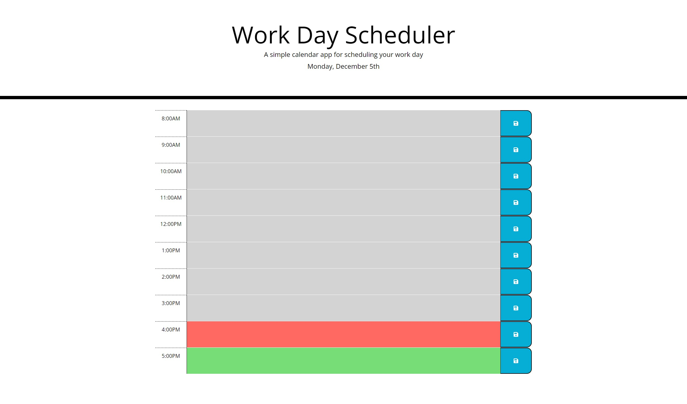

# Prince's Challenge5-Third-Party APIs: Work Day Scheduler

## User Story

**AS** A student

**I WANT** to create a schedule to add important events to a daily planner

**SO THAT** users can manage time effectively

## Acceptance Criteria

**GIVEN** user using a daily planner to create a schedule

**WHEN** user opens the planner

**THEN** the current day is displayed at the top of the calendar

**WHEN** user scrolls down

**THEN** user is presented with timeblocks for standard business hours

**WHEN** user views the timeblocks for that day

**THEN** each timeblock is color coded to indicate whether it is in the past, present, or future

**WHEN** user clicks into a timeblock

**THEN** user can enter an event

**WHEN** user clicks the save button for that timeblock

**THEN** the text for that event is saved in local storage

**WHEN** user refreshes the page

**THEN** the saved events persist

## Screenshot of Deployed site

## Deployed Link
[Deployed Site] (https://reggiejr44.github.io/princecoding-thirdpartyapi-workdayscheduler/)
